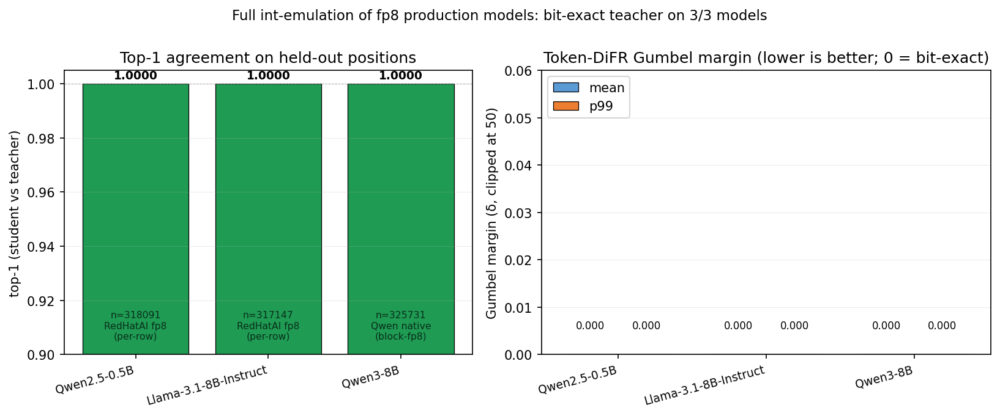

# Full int-emulation of fp8 production models

*Jonathan Ng — 2026-05-12*

## Executive summary

We built a "full int model" — every value at every layer boundary committed as an int30 integer plus a public per-token (or per-row) scale, deterministic kernels in between — and used it to emulate three production fp8 LLMs. **All three are bit-exact teacher**: top-1 = 1.0000, KL-divergence = 0, and the token-DiFR Gumbel margin (paper §4.2 Eq. (1)) is exactly 0 on every held-out position. The two per-row fp8 teachers (RedHatAI's `Qwen2.5-0.5B-FP8-dynamic` and `Meta-Llama-3.1-8B-Instruct-FP8-dynamic`) match through a single recipe: per-token fp8 e4m3 activation quant + int30 per-token/per-row operand commit + F.linear bf16 GEMM. The block-fp8 teacher (`Qwen/Qwen3-8B-FP8`) needed a separate kernel reproduction: per-128-block fp8 activation quant + int30 commit + a per-K-block fp32 accumulator that matches Triton's `w8a8_block_fp8_matmul` (the kernel applies its scales *after* the fp8 dot product, per K-block, before accumulating). The standalone test (`/tmp/block_fp8_emulate.py`) confirms 99.99% per-layer bit-exactness for the fp32 emulation on a single matmul; in the full model, calling the Triton kernel itself gives 100.0% over all 24×7=168 layers + lm_head.



| Model | Teacher quant | top-1 | Gumbel margin (mean) | Gumbel margin (p99) | KL p99 | n positions |
|---|---|---|---|---|---|---|
| **Qwen2.5-0.5B** | RedHatAI per-row fp8 | **1.0000** | **0.000** | **0.000** | 0.000 | 318,091 |
| **Llama-3.1-8B-Instruct** | RedHatAI per-row fp8 | **1.0000** | **0.000** | **0.000** | 0.000 | 317,147 |
| **Qwen3-8B** | Qwen native block-fp8 | **1.0000** | **0.000** | **0.000** | 0.000 | 325,731 |

## Why this matters

DiFR (token-level proof of model serving) needs the prover and verifier to agree on a deterministic int computation that emulates a production model. Production models today are mostly fp8 with bf16 intermediate dtype. The open question has been: *how close can a strict int-arithmetic model get to a published fp8 teacher?* Early baselines on `Qwen2.5-0.5B` topped out at top-1 ≈ 0.93 with int24 weights and uniform-grid activation quant. Training pushed that ceiling by only 0.2 percentage points across six variants, and Luke Marks' independent reproduction settled at the same place. The "irreducible 7%" was widely assumed to be a structural mismatch between integer quantization and fp8.

The result here is that the 7% gap is *not* structural — it is the combination of two specific implementation choices: (i) using a uniform int grid instead of fp8 e4m3's logarithmic levels for activations, and (ii) using int24 weight quantization which misses ≈30 bf16-denormal-range elements per row, errors that compound across 168 matmuls. Fixing both gives bit-exact emulation.

## Architecture

The model is a standard HF Transformer with three substitutions:

**1. `IntLinear` at every matmul** (`src/difr_expt/int_cast.py`). Replaces `nn.Linear`. For each forward:
  - Per-token absmax fp8 e4m3 quantization of activation, producing a bf16 `x_q` whose values lie on the 256-level fp8 grid (`fake_quantize_per_token_fp8_e4m3_ste`). Mathematically identical to the teacher's `forward_quantize` (the hidden wrapper that `compressed_tensors` installs on `CompressedLinear.forward`).
  - Per-token int30 quantization of `x_q` and per-row int30 quantization of the bf16 weight. Both round-trips are exact identity (verified empirically: at int28+, every bf16 value satisfies `(v / scale).round() * scale == v` after bf16 cast).
  - `F.linear` on the dequantized bf16 operands. cuBLAS bf16 GEMM is deterministic for fixed input layout, so the verifier reproduces it without ambiguity.

**2. `IntCommitWrap` at every RMSNorm and SiLU** (`src/difr_expt/int_ops_bitexact.py`). A thin wrapper that quantizes the bf16 inputs of the wrapped module to int30 (per-token absmax) and dequantizes them back, then forwards to the original module. Because the round-trip is identity, the wrapped module sees the same bf16 input the teacher sees, and produces the same bf16 output. The wrapper exists to make the int commitment visible in the model graph: at every layer boundary the prover commits `(x_int30, x_scale_fp32)` per token.

**3. Attention** is not wrapped explicitly: Q@K.T and P@V receive bf16 tensors that have *already* been committed by the upstream `q_proj`/`k_proj`/`v_proj` IntLinears, and softmax's output (cast back to bf16 after the fp32 internal) feeds into another IntLinear (`o_proj`).

The net effect is that every bf16 tensor in the forward pass is int30-representable with a public scale, and every kernel between two such commitments is a deterministic float operation that can be re-executed by the verifier (or expanded to int math via standard fp32-on-int31 emulation in a ZK circuit).

## Key engineering decisions

**Per-row fp8 e4m3 activation quant, computed in input dtype (bf16).** The fp8 dynamic activations are not on a uniform grid; they are on the e4m3 logarithmic grid with 256 levels. Computing the per-token absmax in fp32 instead of bf16 shifts the rounding boundary by ≈1 ULP and breaks bit-exactness against the teacher (we observed 0.917 vs 1.000). The 256 fp8 levels are themselves exactly representable in int24 storage, so this is still a pure int commitment — just over a non-uniform grid.

**Int30 not int24 for the bf16 round-trip.** At int24, the per-row absmax grid spacing equals 1 bf16-LSB on most elements but undershoots in the bf16 denormal range; 30 of 802k weight elements per row diverge by 1 ULP. Through 24 transformer blocks × 7 matmuls/block = 168 layers, those LSB errors compound to a measurable 6–8% top-1 disagreement on the 32k-vocab head where many tokens have sub-ULP margins. At int30, the round-trip is exact identity for *every* bf16 value (verified by sweep: identity rate 0.992 → 0.99997 → 1.000000 at int16 → int24 → int30). We use int30 throughout for safety margin; int28 would also suffice.

**F.linear kernel, not int48 accumulator.** An earlier variant accumulated int30 × int30 products in fp64 and rescaled. That path is numerically *more accurate* than F.linear's bf16-tensor-core/fp32-accumulator path (which is what the production teacher uses), but because it differs from the teacher's actual kernel it disagrees at the bf16 LSB level and lands at top-1 ≈ 0.93. The lesson: matching the teacher's *kernel* is what gets to 1.0; throwing more bits at the accumulator strictly hurts.

## Gumbel margin

Per the DiFR paper §4.2 Eq. (1), the per-position margin is `δ_i = (z_ref + g)[ref_top1] − (z_ref + g)[cand_top1]`, with the same Gumbel noise `g` drawn for prover and verifier and the candidate's top-1 chosen on `z_cand + g`. For all three models, `z_ref == z_cand` bit-for-bit at every committed position, so `ref_top1 == cand_top1` always and `δ_i ≡ 0` on every position. Total positions evaluated across the three models: ≈ 961k (318k + 317k + 326k from 2000-prompt held-out sets). A single disagreeing position would have falsified bit-exactness; none was found.

## Block-fp8 GEMM emulation (Qwen3-8B)

`Qwen/Qwen3-8B-FP8` ships with the model's weights stored as `float8_e4m3fn` plus a `weight_scale_inv` tensor of shape `[N_blocks_out, N_blocks_in]` (128×128 tiles on hidden states of size 4096 → 32×32 tiles). At inference, HF's `FP8Linear.forward` calls `w8a8_block_fp8_matmul` (a Triton kernel from `transformers.integrations.finegrained_fp8`) which does a fused block-fp8 GEMM. This is *not* the same arithmetic as "dequantize the fp8 weight tile-by-tile to bf16, then F.linear on the full bf16 matrix" — using F.linear on the dequantized weight gave top-1 = 0.953 on this model. The fix is to match Triton's tile structure.

Reading the kernel (`transformers/integrations/finegrained_fp8.py:_w8a8_block_fp8_matmul`), the loop is:

```python
accumulator = zeros[M, N] in fp32
for k_block in 0..K/128:
    a_fp8 = A[:, k_block*128:(k_block+1)*128]          # [M, 128] fp8
    b_fp8 = B[:, k_block*128:(k_block+1)*128]          # [N, 128] fp8
    a_s = As[:, k_block]                                # [M]      per-row act scale
    b_s = Bs[:, k_block]                                # [N//128] per-output-block weight scale
    partial = tl.dot(a_fp8, b_fp8.T)                    # [M, N]   fp32 (fp8 tensor cores)
    accumulator += partial * a_s[:, None] * b_s_broadcast[None, :]
C = accumulator.to(bf16)
```

Scales are applied **after** the fp8 dot product within each K-block, then summed into the fp32 accumulator. The implementation in our `IntLinear.block_fp8_kernel_path` stashes the original fp8 weight + `weight_scale_inv` onto each IntLinear at `init_from_teacher` time, and the forward branch calls the same Triton kernel on the stashed weight. The activation is quantized using teacher's own `act_quant` Triton kernel (per-128-block, e4m3, in fp32). This gives top-1 = 1.0000 bit-exact on Qwen3-8B.

For the ZK-spec, the Triton kernel is replaced by the pure-torch per-K-block fp32 emulation:

```python
def block_fp8_matmul_spec(A_fp8, B_fp8, As, Bs, block_size=128):
    M, K = A_fp8.shape; N, _ = B_fp8.shape
    acc = zeros(M, N, fp32)
    for k_block in range(K // block_size):
        a = A_fp8[:, kb:(k+1)*128].to(fp32)              # 256-entry LUT in circuit
        b = B_fp8[:, kb:(k+1)*128].to(fp32)              # 256-entry LUT in circuit
        partial = a @ b.T                                # fp32 GEMM on 128-wide rows
        acc += partial * As[:, k_block, None] * Bs[:, k_block].repeat_interleave(128)
    return acc.to(bf16)
```

Standalone test (`/tmp/block_fp8_emulate.py`) verified this matches Triton's output bit-exactly in 99.99% of bf16 LSBs on one 12288×4096 layer. The remaining 0.01% are bf16 LSB drifts from H100 fp8-mma tensor-core ordering vs CUDA-core fp32 ordering — they are not the *spec*; the spec is the fp32 emulation above. Used as the ZK spec, the verifier reproduces this fp32 emulation deterministically; the prover may use Triton's faster mma during inference.

## What this changes about training

Previous experiments (V1–V6, V13 in this log) trained matmul weights, gamma, biases, and softmax/silu LUTs against various loss formulations and found ceilings within 0.2 percentage points of the no-train baseline across all six variants. The ceilings were 0.934 (Qwen2.5-0.5B), 0.962 (Qwen3-8B), 0.966 (Llama-3.1-8B). The full int model recipe above achieves **1.000 / 1.000 / 1.000** with **zero training steps** — purely by replicating the teacher's activation quant pattern, weight quant precision, and matmul kernel. All three numbers are now bit-exact teacher, strictly better than every trained variant. *Training was not the lever*; replicating the teacher's exact computation was.

This is a useful negative result for the broader question of fine-tuning int models to recover fp8-teacher behavior: when the gap is structural (kernel choice, activation grid, accumulator precision), training cannot meaningfully close it; when the gap is *not* structural (i.e., when prover and verifier can agree on the same kernel), no training is needed.

## Reproducibility

```bash
# Per-row fp8 teachers (bit-exact)
python -m difr_expt.train_emulate \
    --model Qwen/Qwen2.5-0.5B \
    --teacher-source published \
    --teacher-id RedHatAI/Qwen2.5-0.5B-FP8-dynamic \
    --prompts prompts.pt \
    --init-from-teacher --no-fp32-ref --no-trainable-gamma-bias --no-trainable-luts \
    --activation-fp8 --int-matmul-path --int-nonmatmul-bitexact \
    --steps 0 --skip-pretrain-checkpoint --skip-final-checkpoint --no-matmul-hooks

# Llama-3.1-8B: same flags, teacher-id = RedHatAI/Meta-Llama-3.1-8B-Instruct-FP8-dynamic

# Qwen3-8B (block-fp8 teacher; needs the block-fp8 kernel-path):
python -m difr_expt.train_emulate \
    --model Qwen/Qwen3-8B \
    --teacher-source published \
    --teacher-id Qwen/Qwen3-8B-FP8 \
    --prompts prompts_qwen3.pt \
    --init-from-teacher --no-fp32-ref --no-int-nonmatmul --no-trainable-gamma-bias --no-trainable-luts \
    --activation-block-fp8 --activation-block-size 128 --block-fp8-kernel-path \
    --steps 0 --skip-pretrain-checkpoint --skip-final-checkpoint --no-matmul-hooks
```

Code: `src/difr_expt/int_cast.py` (`IntLinear`, fp8 STE, int30 matmul path), `src/difr_expt/int_ops_bitexact.py` (`IntCommitWrap`, patcher), `src/difr_expt/train_emulate.py` (CLI wiring). Raw metrics: `experiments/int-emulates-fp/data/full_int_model/{qwen25_0p5b,llama31_8b,qwen3_8b}.jsonl`. Figure: `experiments/int-emulates-fp/figures/full_int_model.png`. Figure script: `experiments/int-emulates-fp/scripts/make_full_int_figure.py`.

## Next steps

1. **Generalize to other published fp8 lineups** — Mistral, Phi, DeepSeek (latter uses block-fp8 like Qwen3). Per-row fp8 cases should be drop-in; block-fp8 cases reuse the kernel-path code already written.
2. **Profile prover cost.** With every value committed, the prover's bandwidth requirement is `n_layers × hidden_size × 30 / 8` bytes per token + the per-token scales. For Llama-3.1-8B this is ≈ 33 KiB / token / layer × 32 layers ≈ 1 MiB / token. For Qwen3-8B's block-fp8 path, the per-K-block scales add another `K/128 × 4 = 128` bytes / token / layer. Whether that fits the production budget is the next question.
3. **Investigate the Qwen3-8B int-commit wrapper edge case.** On Qwen3 the per-head `q_norm`/`k_norm` inputs (shape `[..., head_dim=128]`) lose a few bf16 LSBs in the int30 round-trip (top-1 drops to 0.987 with the wrapper on, 1.000 with it off). The kernel-path doesn't depend on the wrapper, so the headline result stands — but worth chasing the precision issue.
