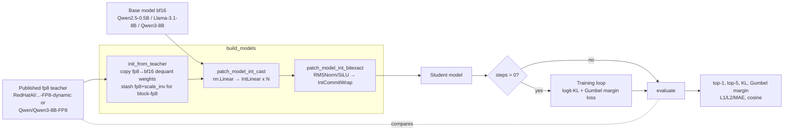
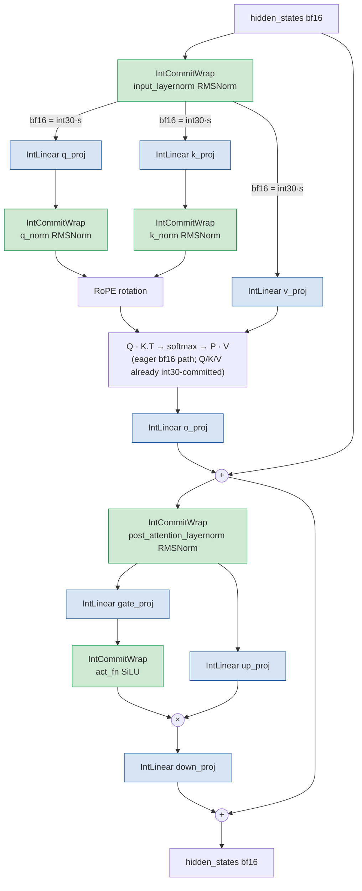
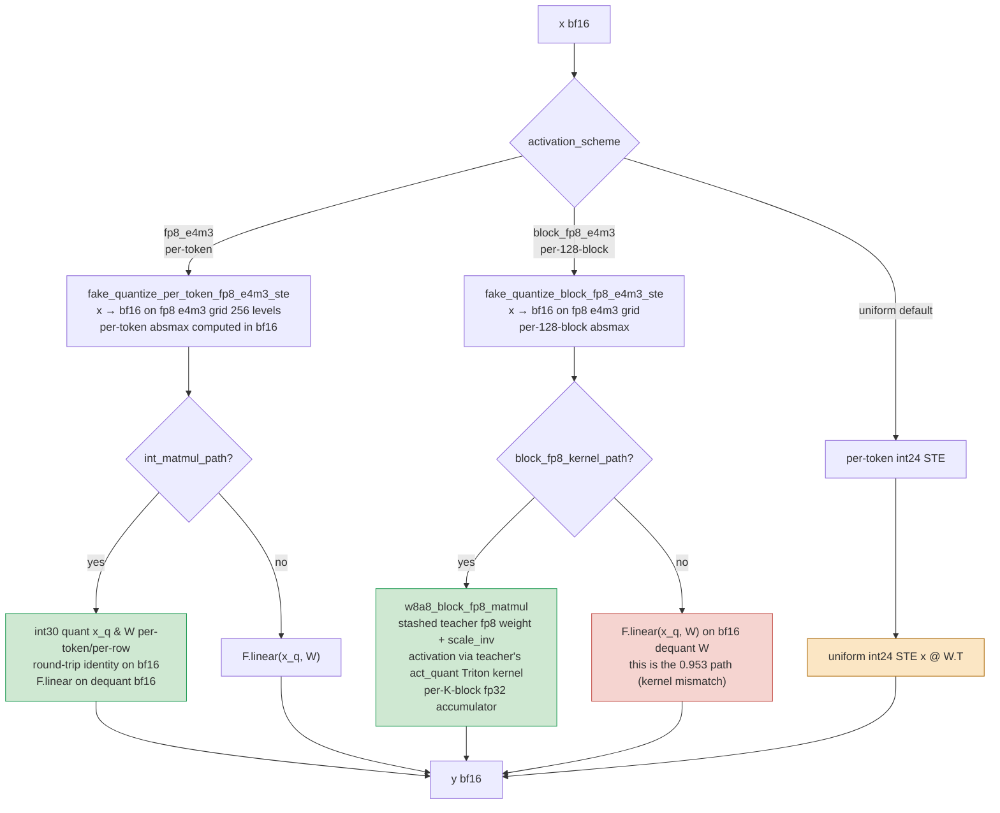

# Full int model — pipeline diagrams

Diagrams render natively on GitHub. Code paths: `src/difr_expt/train_emulate.py` (build + eval),
`src/difr_expt/int_cast.py` (`IntLinear`), `src/difr_expt/int_ops_bitexact.py` (`IntCommitWrap`).

## 1. Top-level pipeline



## 2. Per-block forward pass — where int commits live



Green nodes = `IntCommitWrap` (int30 bf16 round-trip = identity, makes commitment visible).
Blue nodes = `IntLinear` (int operands + matmul kernel; details below).

## 3. `IntLinear` forward — branches by activation scheme



Green = bit-exact-teacher paths used in this experiment.
Red = block-fp8 fallback that gives top-1 ≈ 0.953 (kernel mismatch).
Yellow = legacy uniform-int24 path (gives top-1 ≈ 0.93, not used in the final result).

## 4. Per-position eval

```mermaid
flowchart LR
  P[held-out prompt] --> TF[teacher forward<br/>fp8 dynamic]
  P --> SF[student forward<br/>full int model]
  TF --> ZR[z_ref logits]
  SF --> ZC[z_cand logits]
  G[Gumbel0,1 noise<br/>same draw for both] --> M
  ZR --> M[post_gumbel_margin<br/>δ = max ZR+g − ZR+g at argmax ZC+g]
  ZC --> M
  ZR --> T1[top-1 match: argmax ZR == argmax ZC]
  ZC --> T1
  ZR --> KL[KL ZR || ZC]
  ZC --> KL
  M --> Agg[Aggregate over ~320k positions per model]
  T1 --> Agg
  KL --> Agg
  Agg --> Out[top-1 / KL / margin tables and figure]
```

## What "full int" means at each surface

| Surface | int commitment | Kernel between commits |
|---|---|---|
| Activation entering each Linear | per-token fp8 e4m3 (256-level grid → int8 LUT) for Qwen0.5B/Llama; per-128-block fp8 e4m3 for Qwen3 | — |
| Weight in each Linear | per-row int30 + fp32 scale (or per-128×128-tile fp8 + scale_inv for Qwen3) | — |
| RMSNorm input | per-token int30 + fp32 scale (round-trip identity on bf16) | torch RMSNorm (cast to fp32, pow².mean, rsqrt, multiply by gamma) |
| SiLU input | per-token int30 + fp32 scale | torch sigmoid + multiply |
| Attention Q/K/V | int30 from upstream `q_proj`/`k_proj`/`v_proj` IntLinear outputs | `F.linear(bf16)` plus RoPE rotation, softmax, `F.linear(bf16)` |
| Matmul output | bf16 (next layer's commit point) | — |

Every kernel between commits is a deterministic function of its committed inputs (in a ZK
circuit, expand to fp32-on-int31 arithmetic with bf16-keyed LUTs for `rsqrt`, `exp`, `sigmoid`,
`sin`, `cos`). The fp8 dynamic activation quant is itself a 256-entry public LUT.
