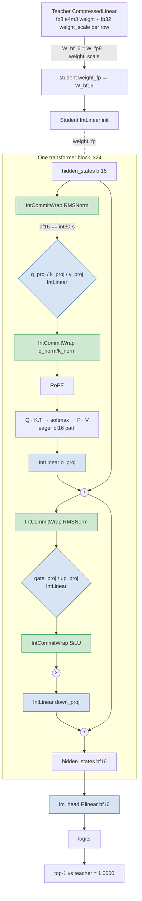
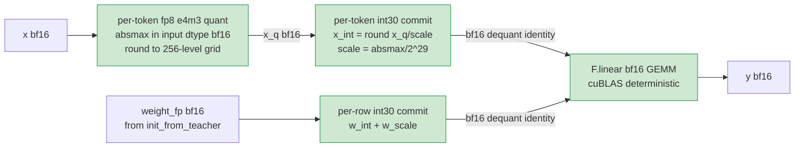
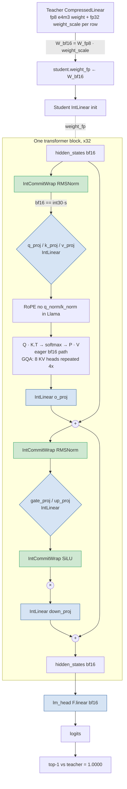
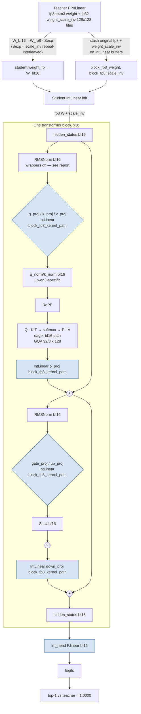
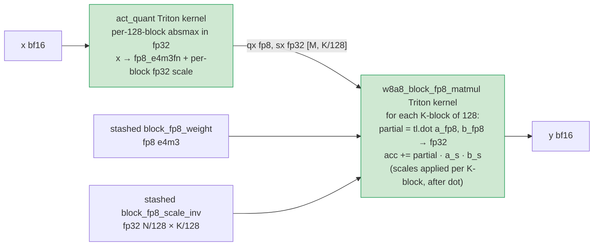

# Bit-exact int emulation — pipeline per model

Zero training. The student is built once from the teacher and evaluated. Top-1 = 1.0000 on each
of the three models, KL = 0, Gumbel margin = 0 across ~320k held-out positions each
(see [full_int_model.md](full_int_model.md)).

Code paths: `src/difr_expt/train_emulate.py::build_models` (cast + patch),
`src/difr_expt/int_cast.py::IntLinear` (matmul forward),
`src/difr_expt/int_ops_bitexact.py::IntCommitWrap` (RMSNorm/SiLU commit).

---

## Qwen2.5-0.5B — per-row fp8 recipe

Teacher: `RedHatAI/Qwen2.5-0.5B-FP8-dynamic` (per-row fp8 e4m3 weights, per-token fp8 dynamic
activations). 24 transformer blocks, hidden=896, 14 heads × head_dim=64. **n_positions=318,091
→ top-1 = 1.0000.**

**Inside each `IntLinear` (Qwen0.5B path):**

CLI: `--activation-fp8 --int-matmul-path --int-nonmatmul-bitexact`.

---

## Llama-3.1-8B-Instruct — same per-row fp8 recipe

Teacher: `RedHatAI/Meta-Llama-3.1-8B-Instruct-FP8-dynamic` (per-row fp8 e4m3 weights, per-token
fp8 dynamic activations). 32 transformer blocks, hidden=4096, GQA 32 heads / 8 KV heads ×
head_dim=128. **n_positions=317,147 → top-1 = 1.0000.**

`IntLinear` internals identical to Qwen0.5B (per-token fp8 + int30 + F.linear).
CLI: `--activation-fp8 --int-matmul-path --int-nonmatmul-bitexact`.

---

## Qwen3-8B — block-fp8 kernel-path recipe

Teacher: `Qwen/Qwen3-8B-FP8` (per-128×128-tile fp8 e4m3 weights with `weight_scale_inv`, per-128-block
fp8 dynamic activations via Triton `act_quant`). 36 transformer blocks, hidden=4096, GQA 32 heads
/ 8 KV heads × head_dim=128, **with** `q_norm`/`k_norm`. **n_positions=325,731 → top-1 = 1.0000.**

**Inside each `IntLinear` (Qwen3 block-fp8 path):**

CLI: `--activation-block-fp8 --block-fp8-kernel-path` (no `--int-nonmatmul-bitexact` — the int30
wrapper on per-head `q_norm`/`k_norm` `[..., 128]` shape loses bf16 LSBs; the kernel path doesn't
need it). ZK spec: replace the Triton kernel with a per-K-block fp32 emulation (verified 99.99%
bf16-bit-exact in standalone test; see [full_int_model.md](full_int_model.md) § "Block-fp8 GEMM emulation").

---

## Surface → int commitment

| Surface | Qwen2.5-0.5B / Llama-3.1-8B | Qwen3-8B |
|---|---|---|
| Activation entering each Linear | per-token fp8 e4m3 (256-level → int8 LUT) | per-128-block fp8 e4m3 (Triton `act_quant`) |
| Weight in each Linear | per-row int30 + fp32 scale (round-trip identity on bf16) | per-128×128-tile fp8 + fp32 `weight_scale_inv` (stashed from teacher) |
| Matmul kernel | `F.linear` bf16 GEMM (deterministic) | `w8a8_block_fp8_matmul` (per-K-block fp32 accumulator) |
| RMSNorm / SiLU input | per-token int30 + fp32 scale (`IntCommitWrap`) | bf16 (kernel path covers the commitment via upstream IntLinear outputs) |
| Attention Q/K/V | int30 from upstream `q_proj`/`k_proj`/`v_proj` | per-128-block fp8 from upstream |
| Matmul output → next layer | bf16, re-committed at next IntLinear's input | same |
