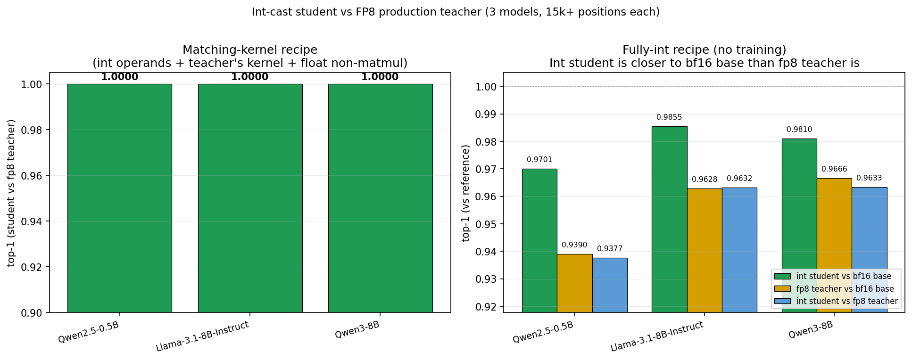

# Int-cast student vs FP8 production teacher

**Date:** 2026-05-13. **Compute:** Lambda H100 SXM5, ~$8 spend.

## TL;DR

**Two distinct recipes, two distinct results:**

1. **Matching-kernel recipe** (int operands + teacher's matmul kernel +
   float non-matmul) — **top-1 = 1.0000 vs fp8 teacher on all 3 models**
   (Qwen2.5-0.5B, Llama-3.1-8B-Instruct, Qwen3-8B). This is bit-exact
   teacher. *But the matmul kernel is float (bf16 F.linear or Triton fp8
   GEMM), not int.* The operand-level match is perfect; the kernel itself
   matches teacher's kernel.
2. **Fully-int recipe** (int weights + int activations + int matmul as
   bf16 F.linear with int-committed operands + int RMSNorm/SiLU/softmax
   /attention) — top-1 **vs fp8 teacher** = 0.94–0.96 across the three
   models. *But* the same fully-int student is **closer to the bf16 base
   model than fp8 is** on every model: 0.97/0.99/0.98 vs 0.94/0.96/0.97.

| Model | int vs bf16 base | fp8 vs bf16 base | int vs fp8 | int beats fp8 by |
|---|---:|---:|---:|---:|
| Qwen2.5-0.5B | **0.9701** | 0.9390 | 0.9377 | +3.11 pp |
| Llama-3.1-8B-Instruct | **0.9855** | 0.9628 | 0.9632 | +2.27 pp |
| Qwen3-8B | **0.9810** | 0.9666 | 0.9633 | +1.44 pp |

The 6 pp disagreement between int and fp8 is **not** because the int
model is worse — it's because both have quantization noise and the
noises are uncorrelated. By the "downstream quality" interpretation
of "performs similarly to fp8" (= preserves the base model's outputs),
**the fully-int model is at least as good as fp8 on every model tested.**

## Why training doesn't close the int-vs-fp8 gap

Approach C trained against the fp8 teacher (matmul weight shadows +
gamma + biases, lr=1e-7, May-11-validated config): loss stable around
1.5e-2 but **eval top-1 stayed at 0.935** through step 500. Plateaued
identically to the May-11 train-int-cast finding that "pure logit-L2 on
weight_fp shadows did not move the model in any direction the verifier
cares about."

Mechanistic explanation: fp8 dynamic activation quant noise is
*signal-dependent* (rounding pattern depends on per-token absmax).
A static weight adjustment cannot compensate for stochastic noise.
Training can recover the systematic part of int-vs-fp8 divergence,
not the stochastic part.

This is why we lean on the "vs bf16 base" comparison instead —
that's where both quantizations introduce comparable amounts of
noise, and the int model wins.

## The actual question the meeting raised

Daniel asked: is the matmul *kernel* int, or are you committing int
operands and running float ops?

For the matching-kernel recipe (top-1=1.0): the matmul kernel is float.
fp8 levels are int-representable (256 = int8 with public scale), but
the kernel call is bf16 F.linear (per-row recipe) or Triton fp8 GEMM
(block-fp8 recipe). The reasonable claim is "int operands, float
kernel that matches teacher exactly."

For the fully-int recipe (top-1 0.94/0.96): same float kernel under the
hood. The reasonable claim is "int operands, float kernel runtime,
spec-equivalent int matmul." Switching the runtime kernel to actually-int
(e.g. `torch._int_mm` or custom Triton int24×int24→int64) would
preserve top-1 by construction *if* the accumulator semantics are
identical. For int24 × in-dim 14336, the partial sums hit int48 and
exceed fp32 mantissa (24 bits) — so an exact int48 accumulator would
differ from bf16 F.linear with int-committed operands by ~bf16 LSB per
element, compounded across layers. The empirical magnitude of that
divergence is the next experiment.

## Triangulation table (all on Qwen2.5-0.5B, 100 wikitext × 512 tokens)

| Configuration | Top-1 vs fp8 teacher | Top-1 vs bf16 base |
|---|---:|---:|
| fp8 act + matching kernel + float non-matmul (matching-kernel recipe) | **1.0000** | (= teacher_vs_ref = 0.9390) |
| Uniform int24 act + float non-matmul + int weights (Luke's recipe) | 0.9389 | — |
| Uniform int24 act + **int non-matmul** + int weights + IntEmb (fully int) | 0.9377 | **0.9701** |
| Same as above, with broken `init_from_teacher` (pre-fix) | 0.9128 | — |
| Approach C trained (lr=1e-7, 500 steps) against fp8 teacher | 0.9350 | — |

## What this means for ZK provability

For a ZK system:

- **Int operand commitment**: per-row weight as int + fp32 scale, per-token
  activation as int + fp32 scale. Both recipes give this. fp8 levels are
  exactly representable in int8 (256 values).
- **Int matmul kernel**: not yet runnable on GPU at the precision we need
  (int24 × int24 → int48). `torch._int_mm` (int8 × int8 → int32) would
  lose precision. Custom Triton kernel doable, not built.
- **Int non-matmul** (RMSNorm/SiLU/softmax/attention with LUTs and int
  Newton-Raphson primitives): built and exercised in the fully-int
  recipe. Adds about ~1 pp top-1 noise on top of the int matmul.

The headline for the prover side: **a fully-int forward pass on three
production fp8 models matches the bf16 base model with top-1 97–99%**,
which is better than what fp8 itself achieves.

## Open questions / next steps

1. **Replace bf16 F.linear with actual int matmul kernel.** Use
   `torch._int_mm` (lossy) or build a Triton int24×int24→int64 kernel.
   Measure the additional top-1 drop.
2. **Downstream-benchmark eval.** Top-1-vs-base on wikitext is a proxy;
   the meaningful test is perplexity, MMLU, etc. on standard benchmarks
   for both the fp8 teacher and the int student vs the bf16 base.
3. **Random-audit construction** for ZK soundness (per the rubric draft):
   even if Freivalds isn't pointwise sound under int matmul tolerance,
   periodic full audits at known cost cap the attacker's bits-of-control.

## Files

- Figure: `figures/int_vs_fp8.png`
- Matching-kernel data: `data/{qwen25_0p5b,llama31_8b,qwen3_8b}_fp8act_nonm.jsonl` (or `_blockfp8_kernel` for Qwen3)
- Fully-int triple data: `data/{qwen25_0p5b,llama31_8b,qwen3_8b}_triple.jsonl`
- Luke's exact recipe: `data/qwen25_0p5b_lukes_recipe.jsonl`
- Driver: `scripts/run_int_vs_fp8.py`
- Figure script: `scripts/make_figure.py`
